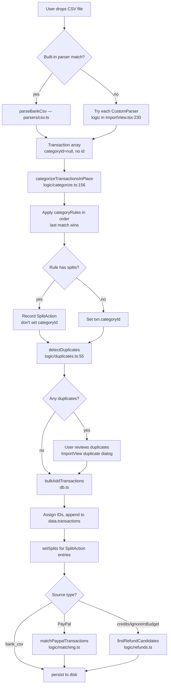
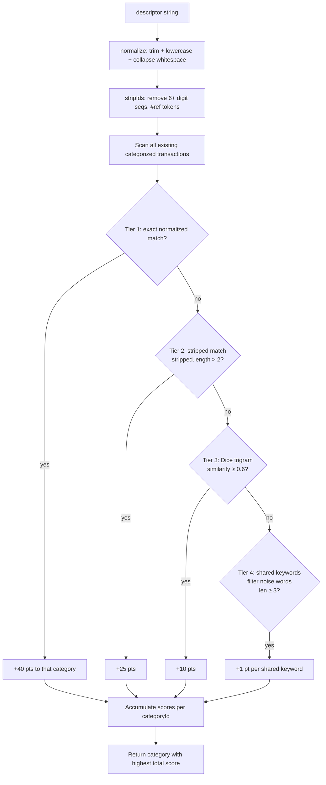
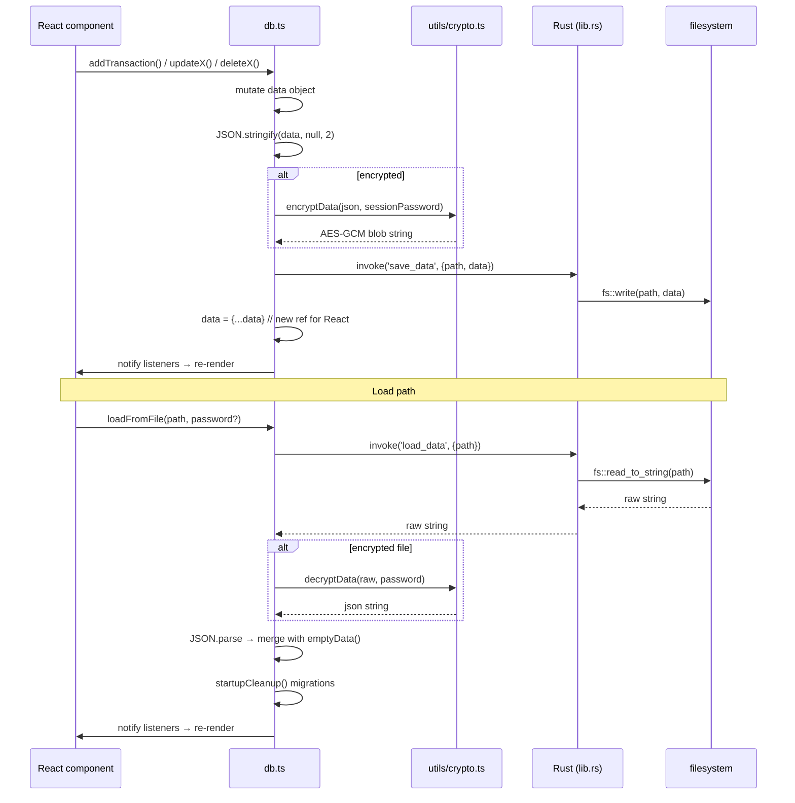

# Claude Code Guidelines for kestl

## Versioning — DO NOT manually edit version numbers

Version numbers are managed automatically by **release-please**. The single source of truth is:

```
src-tauri/tauri.conf.json  →  "version": "x.y.z"
```

`src-tauri/Cargo.toml` and the UI version display are kept in sync automatically:
- `Cargo.toml` is updated by release-please alongside `tauri.conf.json`
- The UI reads `__APP_VERSION__` injected by Vite at build time from `tauri.conf.json`

**Never manually edit version numbers in any file.** release-please reads commit messages to determine the bump and opens a PR to do it.

## Commit messages — always use Conventional Commits

Every commit must follow the [Conventional Commits](https://www.conventionalcommits.org/) format:

```
<type>[optional scope]: <description>

[optional body]
```

| Prefix | Effect | Example |
|--------|--------|---------|
| `fix:` | patch bump (1.2.x) | `fix: duplicate detection for pending transactions` |
| `feat:` | minor bump (1.x.0) | `feat: add parser rename in settings` |
| `feat!:` or `BREAKING CHANGE:` | major bump (x.0.0) | `feat!: new data format` |
| `chore:`, `docs:`, `refactor:`, `test:` | no bump | `chore: update dependencies` |

release-please reads these prefixes to build the CHANGELOG and decide the version bump.

## Release flow

1. Commits land on `main` → release-please action runs
2. release-please opens/updates a "Release PR" that bumps versions and updates `CHANGELOG.md`
3. When you merge the Release PR → release-please creates a `v*` tag
4. The `v*` tag triggers the **release.yml** workflow which builds the Tauri app for Windows + Linux and publishes a GitHub Release with installers attached

---

## Directory map

### `src/` (React/TypeScript frontend)

```
src/
├── App.tsx                     # Root router — renders the active view
├── db.ts                       # ALL in-memory state + persistence (2400 lines — the heart of the app)
├── seed.ts                     # Default categories/budgets for new files; demo data
├── main.tsx                    # React entry point
├── global.d.ts                 # __APP_VERSION__ and other global type declarations
│
├── components/
│   ├── ImportView.tsx           # CSV/Amazon/PayPal import UI; orchestrates the full import pipeline
│   ├── BudgetView.tsx           # Monthly budget overview (spend vs target per category)
│   ├── TransactionView.tsx      # Transaction list; inline categorization and editing
│   ├── SettingsView.tsx         # Encryption, category rules, budget groups, parser management
│   ├── SavingsView.tsx          # Savings buckets and entry log
│   ├── YearView.tsx             # Year-to-date summary across months
│   ├── AIPanel.tsx              # Chat interface to the local Ollama assistant
│   ├── TransactionLookup.tsx    # Single-merchant lookup: web search + LLM identification
│   ├── ParserGenerator.tsx      # LLM-powered builder for custom CSV parsers
│   ├── SplitEditor.tsx          # UI for splitting a transaction across categories
│   ├── MortgageTool.tsx         # Mortgage balance tracking and amortization
│   ├── ToolsView.tsx            # Launcher for MortgageTool and other utilities
│   ├── ExperimentalBudgetsView.tsx  # Named budget templates (import/export/apply)
│   ├── FileSetup.tsx            # First-run: create or open a .budget file
│   ├── PasswordPrompt.tsx       # Password entry for encrypted files
│   ├── ImportBudgetCard.tsx     # Single budget line item used inside ImportView
│   ├── SearchableSelect.tsx     # Reusable filterable dropdown
│   └── DateInput.tsx            # Date picker widget
│
├── logic/
│   ├── categorize.ts            # Rule matching + 4-tier fuzzy scoring (import-time and on-demand)
│   ├── duplicates.ts            # Count-based duplicate detection for incoming CSV rows
│   ├── matching.ts              # PayPal-to-bank-debit linking
│   ├── refunds.ts               # Refund candidate detection and month-date adjustment
│   ├── llm.ts                   # Ollama API calls: chat, suggestCategories, lookupTransaction, generateParser
│   ├── recurring.ts             # Generates transactions from RecurringTemplate records
│   ├── savings.ts               # Savings balance calculations
│   └── dateUtils.ts             # Date arithmetic helpers
│
├── parsers/
│   ├── csv.ts                   # Built-in Scotiabank CSV parser (chequing + credit card)
│   ├── paypal.ts                # PayPal activity paste parser
│   ├── amazon.ts                # Amazon orders & payments HTML/CSV parser
│   └── xlsx.ts                  # Excel import for budget templates and rule sets
│
└── utils/
    ├── crypto.ts                # AES-256-GCM encryption (PBKDF2-SHA256, 100k iterations)
    ├── format.ts                # Currency/number formatting helpers
    └── export.ts                # CSV export
```

### `src-tauri/src/` (Rust backend)

```
src-tauri/src/
├── main.rs     # App entry point — just calls lib::run()
└── lib.rs      # All Tauri command handlers, AppState, config I/O (389 lines)
```

---

## Tauri IPC command surface

All commands are in `src-tauri/src/lib.rs`. Invoked from the frontend with `invoke('command_name', { ...args })`.

### File management

| Command | Signature | What it does |
|---|---|---|
| `get_last_file_path` | `() → Option<String>` | Returns path held in `AppState.file_path` (loaded from config at startup) |
| `set_file_path` | `(path: String)` | Writes `~/.config/budget-app/config.json` and updates `AppState`; call after open/create |
| `load_data` | `(path: String) → Result<String>` | Reads entire file as string (plain JSON or encrypted blob) |
| `save_data` | `(path: String, data: String) → Result<()>` | Writes string to file directly (no temp-file); called by `persist()` in `db.ts` |
| `file_exists` | `(path: String) → bool` | Path existence check |
| `list_dir_files` | `(dir: String, ext: String) → Vec<FileInfo>` | Lists files in `dir` filtered by extension; returns `{path, modified_secs}` — used by FileSetup to show recent files |
| `save_bytes` | `(path: String, bytes: Vec<u8>) → Result<()>` | Raw binary write |
| `save_base64` | `(path: String, data: String) → Result<()>` | Base64-decode then write — used for exporting non-text assets |
| `get_home_dir` | `() → String` | Returns home directory |

### Ollama management

| Command | Signature | What it does |
|---|---|---|
| `find_ollama` | `() → Option<String>` | Checks `~/.local/share/budget-app/bin/ollama`, then `which ollama`; returns path or null |
| `install_ollama` | `(app: AppHandle) → Result<String>` (async) | Linux only: downloads latest Ollama `.tar.zst` from GitHub, extracts to `~/.local/share/budget-app/`, emits `ollama_progress` events with `{status, percent}` |
| `start_ollama` | `(binary_path: String) → Result<()>` | Spawns `ollama serve` as a detached child process |

### Search

| Command | Signature | What it does |
|---|---|---|
| `search_ddg` | `(query: String) → Result<Vec<DdgResult>>` (async) | Queries DuckDuckGo HTML endpoint; parses up to 6 `{title, snippet}` results — used by TransactionLookup |

**Config file path:** `~/.config/budget-app/config.json` — stores only `{ "last_file": "/path/to/file.budget" }`.

---

## State management

### Where budget data lives in memory

`src/db.ts` is a module-level singleton — not React context, not Zustand. The entire app state is one mutable object:

```typescript
// db.ts:255
let data: AppData = emptyData();
let filePath: string | null = null;
let sessionPassword: string | null = null; // never written to disk
```

React components read state via `useSyncExternalStore(subscribe, getData)`. `persist()` creates a new object reference (`data = { ...data }`) after every write so the hook detects the change and re-renders.

### `AppData` interface (db.ts:198)

```typescript
interface AppData {
  nextId: number;                        // monotonic ID generator for all entities
  categories: Category[];
  categoryRules: CategoryRule[];         // auto-categorization rules (last-match wins)
  budgetGroups: BudgetGroup[];           // named groups (Fixed, Variable, etc.)
  budgets: Budget[];                     // monthly spend targets per category
  transactions: Transaction[];
  transactionSplits: TransactionSplit[]; // split portions for split transactions
  savingsBuckets: SavingsBucket[];
  savingsEntries: SavingsEntry[];
  savingsSchedules: SavingsSchedule[];   // deprecated recurring savings
  recurringTemplates: RecurringTemplate[];
  splitTemplates?: SplitTemplate[];      // named split patterns (reusable)
  amazonOrders?: AmazonOrder[];          // product metadata matched to transactions
  aiSettings?: AISettings;              // Ollama URL + model name
  customParsers?: CustomParser[];        // user-defined CSV parsers (evaled JS)
  aiCategoryFeedback?: AICategoryFeedback[]; // LLM suggestion training data
  experimentalBudgets?: ExperimentalBudget[];
  completedMigrations?: string[];        // migration IDs run by startupCleanup
  colorThresholds?: ColorThresholds;
  mortgage?: MortgageConfig;
  mortgageLedger?: MortgageLedgerEntry[];
}
```

### Persistence pattern

Every mutation function in `db.ts` follows:
```typescript
export async function addTransaction(txn: Omit<Transaction, 'id'>): Promise<number> {
  pushUndoSnapshot();          // optional — only on destructive ops
  const id = nextId();
  data.transactions.push({ id, ...txn });
  await persist();             // serialize → (encrypt?) → invoke('save_data')
  return id;
}
```

`persist()` (db.ts:297):
1. `JSON.stringify(data, null, 2)` — 2-space, human-readable
2. If `sessionPassword`: `await encryptData(json, password)` → AES-256-GCM blob
3. `invoke('save_data', { path: filePath, data: fileContent })`
4. `data = { ...data }` — new reference for React
5. Notify all listeners

### Load / startup

`loadFromFile()` (db.ts:320):
1. `invoke('load_data', { path })` reads raw string
2. Detect encrypted (`isEncryptedFile` checks for `budgetEncV1` key)
3. Decrypt with password or use raw JSON
4. `data = { ...emptyData(), ...parsed }` — missing fields get defaults (handles old file formats)
5. Normalize missing transaction fields (`instrument`, `descriptor`, etc.)
6. `startupCleanup()` (db.ts:401) runs migrations: fixes stale links, bidirectional refund flags, deduplicates bank_csv overlaps, backfills category colors, applies split rules retroactively

### Undo

Three JSON snapshots in `_undoStack: string[]`. Call `pushUndoSnapshot()` before any destructive mutation. `undo()` pops, re-parses, re-persists.

### Encryption

`utils/crypto.ts` — AES-256-GCM with PBKDF2-SHA256 (100,000 iterations). On-disk format:
```json
{ "budgetEncV1": 1, "salt": "<base64>", "iv": "<base64>", "data": "<base64 ciphertext>" }
```
`sessionPassword` lives only in memory and is never written anywhere.

---

## Key data flows

### CSV import pipeline



### Category suggestion scoring tiers



Implemented in `logic/categorize.ts:56`. The batch variant (`batchGetGuessScores`, line 108) pre-processes the corpus once for use when scoring many transactions simultaneously (used in TransactionView and SettingsView to avoid redundant work).

### Save / load



---

## Conventions

### Naming

| Pattern | Meaning |
|---|---|
| `add*()`, `update*()`, `delete*()`, `set*()` in db.ts | Async mutators — always call `persist()` |
| `get*()`, `find*()`, `detect*()`, `compute*()` | Read-only, synchronous |
| `txn` | A `Transaction` object |
| `cat` / `catId` | Category / category ID |
| `norm` / `normalized` | `s.trim().replace(/\s+/g, ' ').toLowerCase()` — always this exact transform |
| `descriptor` | Raw merchant string from the bank |
| `instrument` | Parser name string (e.g. `"Scotiabank Credit Card CSV"`) |
| `rule` | A `CategoryRule` object |

### Where to add a new built-in parser

1. Create `src/parsers/mybank.ts` exporting `parseMyBankCsv(text: string, filename: string): Omit<Transaction, 'id'>[]`
2. Follow the pattern in `src/parsers/csv.ts`: detect by filename, skip pending rows, normalize descriptor, set `ignoreInBudget` based on credit/debit type
3. Wire it into `ImportView.tsx` after the `parseBankCsv()` call (around line 230) — return early if it produces results

Custom (user-defined) parsers live in `AppData.customParsers` as evaled TypeScript function bodies. The UI for creating them is `ParserGenerator.tsx`. Execution happens in `ImportView.tsx` via `executeCustomParser()`.

### Where rules vs. scoring live

| Concern | Location |
|---|---|
| Rule-based categorization at import time | `categorizeTransactionsInPlace()` — `logic/categorize.ts:156` |
| Apply a rule retroactively to history | `runRuleOnHistory()` — `logic/categorize.ts:259` |
| Fuzzy score suggestions (single txn) | `guessCategory()` / `getGuessScores()` — `logic/categorize.ts:85` |
| Fuzzy score suggestions (batch) | `batchGetGuessScores()` — `logic/categorize.ts:108` |
| LLM-based bulk suggestions (import) | `suggestCategories()` — `logic/llm.ts:661` |
| LLM + web search (single merchant) | `lookupTransaction()` — `logic/llm.ts:489` |
| Bulk categorize by pattern (no rule saved) | `bulkCategorizeByDescriptor()` — `logic/categorize.ts:215` |
| Create rule + apply immediately | `createRuleAndApply()` — `logic/categorize.ts:290` |

### Rule matching semantics

- `matchType: 'exact'` — `normalize(rule.pattern) === normalize(txn.descriptor)`
- `matchType: 'contains'` — `normalize(txn.descriptor).includes(normalize(rule.pattern))`
- `amountMatch` — optional; must be within `$0.01`
- All rules iterate in array order; **last match wins** (allows override rules at the end)
- Rules with `splits` (≥2 items) record a `SplitAction` instead of setting `categoryId`

### Adding a new persistent field to AppData

1. Add the field (mark optional `?` for backward compatibility with old files) to the `AppData` interface in `db.ts:198`
2. Add a default in `emptyData()` at `db.ts:237` if the field needs a non-undefined fallback
3. If migration of existing files is needed, add a migration block in `startupCleanup()` at `db.ts:401` and push a migration ID to `completedMigrations` so it only runs once

### Adding a new Tauri command

1. Write an `#[tauri::command]` function in `src-tauri/src/lib.rs`
2. Register it in the `invoke_handler!(...)` macro at line 371
3. Call it from the frontend with `invoke('command_name', { ...args })` from `@tauri-apps/api/core`

### Split transactions

A split transaction has `categoryId = null` at the parent level; the budget amounts come from `transactionSplits` rows. `TransactionSplit.txnDate` is an optional override — if set, that split portion counts toward a different month than the parent transaction. This is used for mortgage principal vs. interest splits that cross month boundaries.
