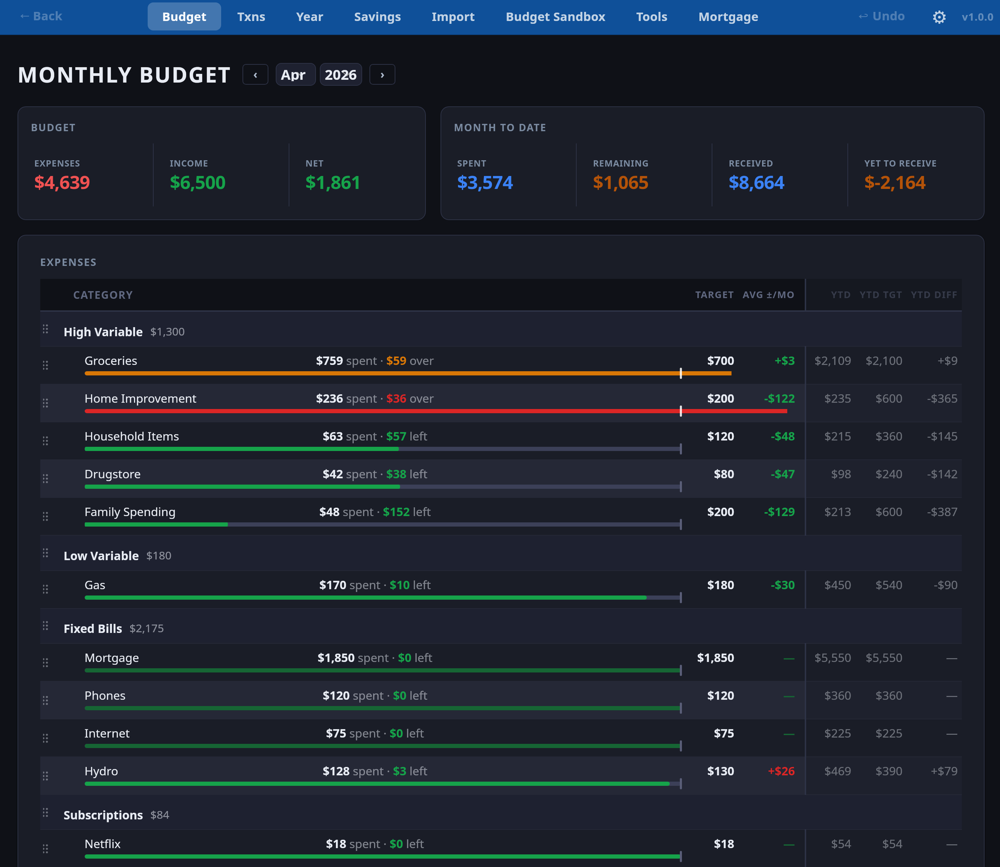
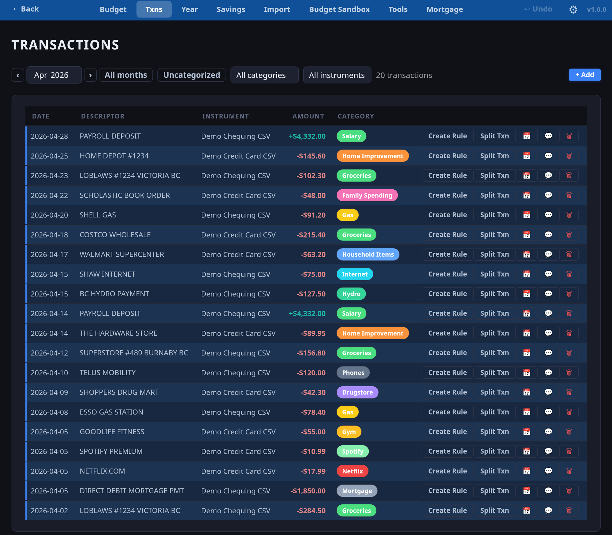
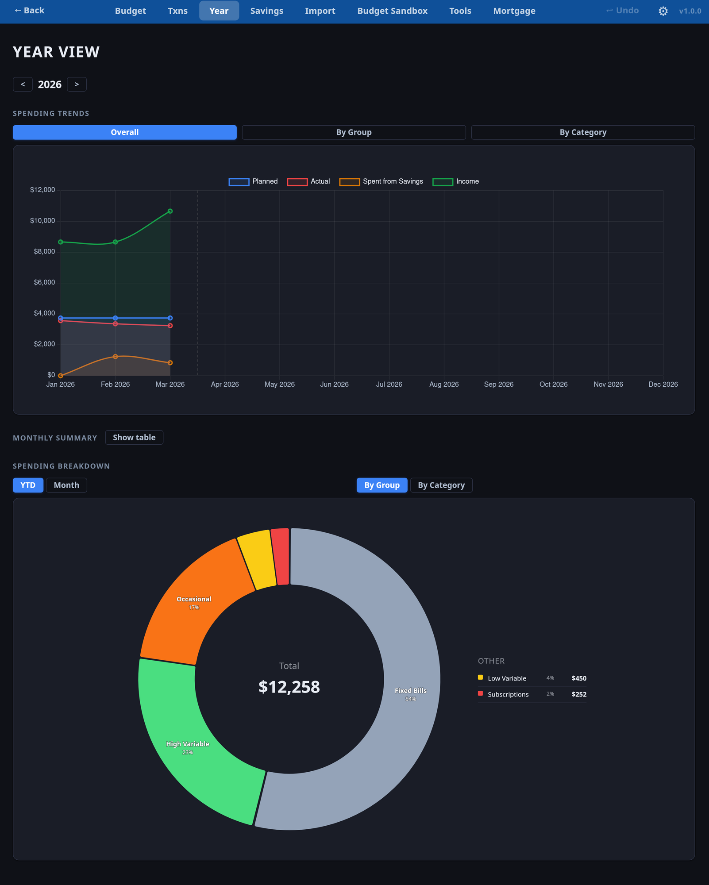
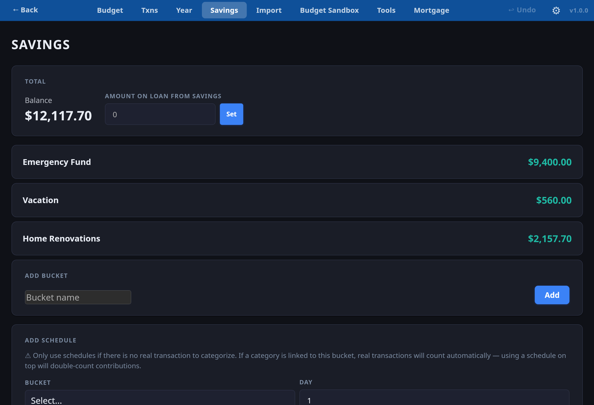
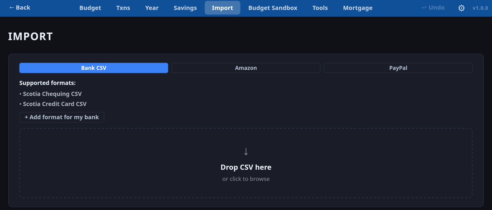
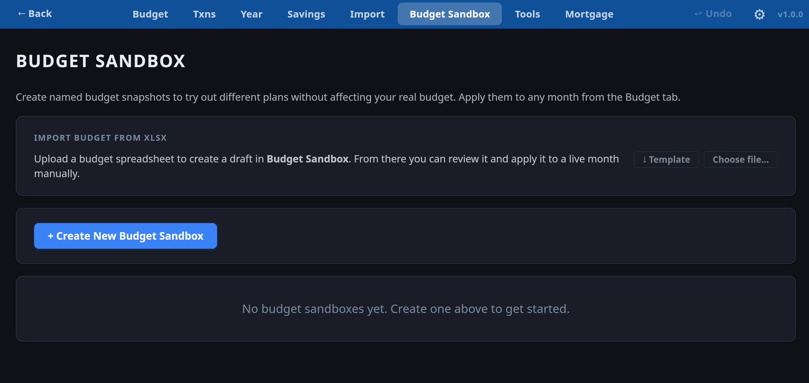
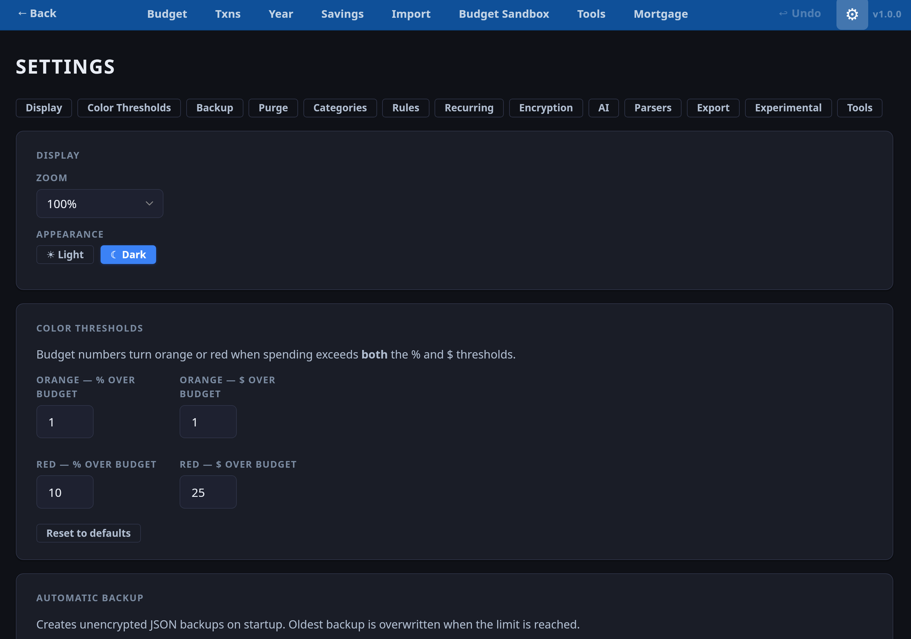

<p align="center">
  
</p>

A privacy-focused personal budgeting desktop app. Create monthly budgets, track spending, and see where your money actually goes — without ever giving your login credentials to a third party or uploading your data to the cloud.

**Your data never leaves your computer.** Everything is stored in a single local file you own and control. Optionally encrypt it with a password.

**[Download latest release →](https://github.com/Kll7Ordin/kestl/releases/latest)**



---

## Why kestl?

Most budgeting apps require you to hand over your bank login or connect via open banking APIs. kestl takes the opposite approach: you export a CSV from your bank and import it yourself. It takes an extra minute, but your credentials stay with you and your financial data stays on your machine.

- **No accounts.** No sign-up, no cloud sync, no third-party servers.
- **Single file.** Your entire budget lives in one JSON file — easy to back up, version, or move between machines.
- **Optional encryption.** Password-protect your data file with AES encryption.
- **Open source.** Runs as a native desktop app via [Tauri](https://tauri.app).

---

## Getting started

### Download

Grab the installer for your platform from the [latest release](https://github.com/Kll7Ordin/kestl/releases/latest):

- **Windows** — `.msi` or `.exe` installer
- **Linux** — `.deb` package or `.AppImage`

### First launch

On first launch you will be asked to open or create a budget file:

- **Open existing file** — open a `.json` budget file you already have.
- **Create new file** — start fresh with the default category template.
- **Load a budget template** — load a pre-built demo budget that you can use or modify.

Choose a location for your file. This can be local on your computer or on a synced folder for cross-device access, using optional encryption.

---

## Quick Start Guide

New to kestl? Here's how to go from zero to a working budget in a few minutes.

### Step 1 — Create your budget file

On first launch, choose **Create new file**. Pick a location (a synced folder like Dropbox or Google Drive works great if you want cross-device access).

The app will create a default set of budget categories to get you started.

> **Want to explore the app with sample data first?** The repository includes a [`demo-data.json`](demo-data.json) file with several months of realistic fake transactions, categories, and budget targets. Open it with **Open existing file** to get a fully-populated budget you can explore and experiment with freely.

### Step 2 — Set up your categories

Go to **Settings → Categories** and review the default categories. Rename, delete, or add categories to match how you actually spend money. Common ones:

- **Groceries**, **Gas** → Essentials
- **Rent/Mortgage**, **Insurance**, **Internet** → Fixed Bills
- **Netflix**, **Spotify** → Subscriptions group

Tip: Mark salary/paycheques as **Income** categories so they appear in the Income section of your budget.

### Step 3 — Set your monthly budget targets

Go to the **Budget** tab. For each category, click the Target amount and type in what you plan to spend that month.

### Step 4 — Import your bank transactions

1. Log in to your bank's website and export your transactions as a CSV file (usually under Account → Download/Export → CSV).
2. In kestl, go to the **Import** tab and drop the CSV file in.
3. If your bank is not supported, click **+ Add format for my bank** and upload a sample CSV — the AI will generate a parser for you (requires Ollama; see the AI section below).

### Step 5 — Categorize your transactions

Go to the **Transactions** tab. Uncategorized transactions will show a dropdown or suggestion chip. Click a suggestion to accept it, or pick a category from the dropdown.

**Create rules to save time:** Click **Create Rule** on any transaction row to create a rule that auto-categorizes all future transactions with the same descriptor. After a few imports you'll find most transactions are categorized automatically.

### Step 6 — Check your budget

Go back to the **Budget** tab to see how your spending compares to your targets. Green = on track. Orange/red = over budget.

Use the **Year** tab for a monthly overview of the whole year and a spending breakdown by group or category.

---

## Tabs

### Budget

Set monthly spending targets per category and track actual spending in real time.


- **Summary cards** — at a glance: total planned Expenses, expected Income, and Net (Income − Expenses). Month-to-date actuals show Spent, Remaining, Received income, and Yet to Receive.
- **Category groups** — organise categories into named groups (High Variable, Fixed Bills, Subscriptions, etc.) with group-level subtotals. Drag and drop to reorder groups and categories.
- **Per-row stats** — each category shows Target, Avg ±/Mo, YTD total, YTD target, and YTD variance. Progress bars are coloured green (on track), orange (slightly over), or red (significantly over) based on configurable thresholds.
- **Income section** — separate income rows showing Expected vs Received per income category.
- **Copy from previous month** — populate a new month's targets from last month with one click.
- **Copy from Budget Sandbox** — apply a saved scenario budget to any month.
- **Import Budget** — import category targets from an XLSX spreadsheet directly from this tab.
- **Undo** — undo any budget edit with the Undo button in the top bar.

---

### Transactions

View, categorise, and search all your transactions.



- **Transaction list** — date, descriptor, instrument (account), amount, and colour-coded category chip.
- **Filters** — filter by month, show all months, filter by category, filter uncategorised-only, or filter by instrument.
- **Search** — press Ctrl+F to search transaction descriptors.
- **Auto-categorisation rules** — create keyword rules (e.g. "LOBLAWS → Groceries") that apply automatically on import. Create a rule from any transaction row with one click.
- **Category suggestion chips** — history-based suggestions appear on each uncategorised transaction based on how you've categorised similar transactions before. See the [Category Guessing](#category-guessing) section for how this works.
- **Deep dive (?)** — click `?` on any transaction to ask the local AI assistant to identify the merchant and suggest a category (requires Ollama).
- **Split transactions** — split a single transaction across multiple categories with custom amounts and optional different budget months.
- **Edit date** — click the calendar icon on any row to correct the transaction date.
- **Manual entry** — add transactions manually without importing a file.
- **Undo** — all categorisations and edits are undoable.

---

### Year View

See your full year at a glance.



- **Spending Trends chart** — line chart with Planned, Actual, Spent from Savings, and Income series across all months of the year.
- **By Group / By Category** — switch the chart between a group-level and category-level breakdown.
- **Monthly summary table** — toggle a table showing Income, Planned, Actual, Variance, and Spent from Savings for each month.
- **Spending Breakdown donut chart** — YTD or single-month breakdown by group or category, with a legend for smaller segments.

---

### Savings

Track savings buckets and contribution schedules.



- **Multiple buckets** — create named buckets (Emergency Fund, Vacation, Home Renovations, etc.) each with its own balance.
- **Total balance** — overall savings balance shown at the top, with an "Amount on Loan from Savings" field to track money temporarily pulled from savings.
- **Manual entries** — record deposits and withdrawals with optional notes.
- **Automatically updates** - link the savings bucket to a budget category and the account balance will update automatically when a new transaction is categorized - ie a standing transfer to your savings account. Set up a rule so this all happens automatically. 
- **Schedules** — set up recurring monthly contributions so balances stay current automatically.

---

### Import

Bring in transactions from your bank or other sources.



- **Bank CSV** — drop a CSV exported from your bank. Built-in support for Scotia Chequing CSV and Scotia Credit Card CSV. Add support for any bank via the Custom Parser Generator (see below).
- **Amazon** — import your Amazon order history by copy and pasting. 
- **PayPal** — import your PayPal transactions by copy and pasting.

Imported transactions are deduplicated automatically, so you don't need to worry about losing the same transactions twice. They are then auto-categorised using your existing rules.

---

### Budget Sandbox

Plan alternative budget scenarios without touching your live data.



- **Named scenarios** — create budgets like "Tight Budget" or "Vacation Month" independently of your live data.
- **Snapshot from a real month** — create a sandbox budget as a copy of any existing month's targets.
- **Import from XLSX** — upload a budget spreadsheet (Category, Monthly Target columns) to create a sandbox budget draft. Download a template to get started.
- **Edit inline** — adjust target amounts and group assignments per category.
- **Apply to any month** — from the Budget tab, copy any sandbox budget into a live month's targets.
- **Totals** — see Total Income, Total Expenses, and Net at a glance for each scenario.

---

### Settings

Configure categories, rules, encryption, parsers, and more.



- **Display** — toggle Light / Dark mode. Adjust zoom level (50%–150%).
- **Color Thresholds** — configure the % and $ over-budget thresholds that trigger orange and red progress bar colours.
- **Automatic Backup** — create rolling JSON backups on each startup.
- **Categories** — create, rename, colour-code, mark as income, and delete categories. Organize categories into named groups.
- **Category Rules** — manage auto-categorisation rules (exact match or contains).
- **Recurring** — define recurring transaction templates that are automatically created each month.
- **Encryption** — set or change a password to encrypt your data file with AES.
- **AI** — configure a local Ollama model (URL and model name). Install or start Ollama directly from Settings.
- **Parsers** — view built-in parsers and manage custom parsers. Create new parsers from any bank CSV.
- **Export** — export as Excel workbook, plain JSON archive, or encrypted JSON archive.
- **Experimental** — opt into experimental features before they're fully released.
- **Tools** — developer/debug utilities.

---

## Custom Parser Generator

The parser generator lets you add support for any bank's CSV export format without writing any code. It works entirely locally — no data leaves your machine.

**Access it from:** Import tab → **+ Add format for my bank**

### Requirements

- [Ollama](https://ollama.com) installed and running locally
- A model pulled and configured in **Settings → AI** (recommended: `qwen2.5:7b` ~4.7 GB — `qwen2.5-coder:7b` also works well for this task)

If Ollama isn't running when you try to generate a parser, a prompt will appear with options to **Start Ollama** or **Install Ollama** directly from within the app.

---

### Step-by-step walkthrough

#### Step 1 — Name your parser and provide a sample

Give the parser a name (e.g. "TD Bank Chequing"). This name is used as the account instrument label on imported transactions and is auto-filled from the filename if you upload one.

Provide a sample of your bank's CSV format in one of two ways:
- **Upload a file** — any CSV/TSV/TXT export from your bank. Only the first 25 lines are sent to the AI; the rest is discarded.
- **Paste text** — paste a few lines directly into the text box if you don't have a file handy.

A few header rows plus 3–5 data rows is enough. The AI only needs to see the structure, not your real transactions.

#### Step 2 — Generate the parser

Click **Generate Parser**. The local LLM reads your sample and writes a JavaScript function:

```javascript
function parseTransactions(text, filename) {
  // AI-generated code — runs entirely in the app, no network calls
  return [ /* array of transaction objects */ ];
}
```

Each returned transaction object must contain:

| Field | Type | Description |
|---|---|---|
| `txnDate` | `string` | Date in `YYYY-MM-DD` format |
| `descriptor` | `string` | Merchant name / description |
| `amount` | `number` | Always positive (the AI uses `Math.abs()`) |
| `ignoreInBudget` | `boolean` | `true` for credits/income, `false` for debits/expenses |
| `instrument` | `string` | Account label — set to the parser name by default |
| `source` | `string` | Always `'custom'` |
| `sourceRef` | `string` | Set to `filename` |
| `categoryId` | `null` | Always null at import time |
| `comment` | `null` | Always null at import time |

**What the AI does:**
- Reads the column layout of your specific bank's CSV
- Identifies which columns are date, amount, description, debit/credit
- Writes the parsing logic, including header-skipping and quote handling

**What the app handles for you:**
- The `parseDate(str)` helper is provided by the app — the AI calls it instead of using `new Date()`. It handles: `M/D/YYYY`, `YYYY-MM-DD`, `DD-Mon-YYYY` (e.g. `15-Jan-2025`), `YYYYMMDD`, and other common bank date formats.
- Any row whose type/status column contains `pending`, `pre-authorized`, `pre-auth`, or similar is automatically skipped.
- All output amounts are forced positive via `Math.abs()`.

You can expand **View generated code** on the preview screen to inspect exactly what the AI wrote.

#### Step 3 — Preview against a real file

Upload a real CSV export from your bank (can be the same file as the sample). The generated parser runs on it **entirely in-memory** — nothing is saved yet. You see a table showing every parsed transaction: date, descriptor, amount, and debit/credit type.

**Account identifier detection:** If the app finds an account number or card identifier in the CSV, the instrument label is automatically set to `"ParserName - account1234"` so transactions from different accounts are distinguishable.

**If the preview shows 0 transactions:** The app re-runs the parser on the first two lines only to surface a specific error message. This usually means a header row is being treated as data, a date format wasn't recognised, or an amount column has unexpected formatting.

#### Step 4 — Fix errors with feedback (if needed)

If the preview looks wrong, you have two options:

- **Regenerate** — runs the AI again with the same sample. Useful if the first attempt produced clearly malformed code.
- **Fix with feedback** — describe the specific problem (e.g. "dates are DD/MM/YYYY not MM/DD/YYYY", "credits and debits are swapped", "amounts include a currency symbol"). The AI receives the **original sample + the previous parser code + your description** and rewrites a corrected version. This is more reliable than regenerating blind.

Repeat until the preview matches what you expect.

#### Step 5 — Save or import

Once the preview looks correct:

- **Correct — Import** — saves the parser and imports these transactions immediately. They are deduplicated against existing transactions and auto-categorised using your rules.
- **Correct — Don't Import Yet** — saves the parser for future use without importing right now. The parser appears under **Settings → Parsers**.

#### Managing saved parsers

Go to **Settings → Parsers** to:
- See all saved custom parsers alongside the built-in ones
- Rename a parser
- Delete a parser you no longer need

---

### What the AI does vs. what the app does

| Responsibility | Who handles it |
|---|---|
| Understanding your bank's CSV column layout | **Local LLM (Ollama)** |
| Writing the row-parsing and column-mapping logic | **Local LLM** |
| Date conversion | **Local LLM** calls the app's `parseDate()` helper |
| Running the parser against your data | **App** (in-memory, no AI) |
| Skipping pending/pre-authorized rows | **App** (enforced by parser rules) |
| Deduplication of imported transactions | **App** |
| Auto-categorisation via rules | **App** |
| Category suggestion chips on uncategorised rows | **App** (no AI — see [Category Guessing](#category-guessing)) |
| Transaction deep-dive chat | **Local LLM** |

---

## Category Guessing

When you import transactions, any that don't match an existing rule are left uncategorised. The app then shows **suggestion chips** — coloured buttons showing the most likely category for each transaction. Clicking a chip accepts the suggestion.

This is **entirely rule-based with no AI involvement**. Here is exactly how it works:

### 1. Rule matching (applied first, at import time)

Before any guessing happens, the app checks your saved category rules against each incoming transaction:

- **Exact rules** — the transaction descriptor must exactly match the rule pattern (after normalisation: trim, collapse whitespace, lowercase)
- **Contains rules** — the rule pattern must appear somewhere in the descriptor
- **Amount filter** — rules can optionally require a specific amount (within $0.01 tolerance)
- **Rules are sorted longest-first** — more specific rules match before general ones

If a rule matches, the category is assigned immediately and no guessing is needed. Rules can also create **split assignments** — a single transaction automatically divided across multiple categories.

### 2. Scoring algorithm (for uncategorised transactions)

For transactions that didn't match any rule, the app scores every existing categorised transaction and builds a ranked list of candidate categories. Scoring uses four tiers, applied in strict priority order:

| Tier | Points | Match condition |
|------|--------|----------------|
| 1 | **40** | Exact normalized descriptor match |
| 2 | **25** | Match after stripping transaction ID codes (long digit sequences, `#ref` tokens) |
| 3 | **10** | Fuzzy trigram similarity ≥ 0.6 (handles typos and minor variations) |
| 4 | **1 each** | Shared meaningful keywords (3+ characters, non-noise words) |

**Normalisation:** descriptors are trimmed, whitespace-collapsed, and lowercased before comparison.

**ID stripping (Tier 2):** vendors often append order or reference numbers to descriptors. For example, `AMAZON #123-4567890` and `AMAZON #987-6543210` both strip to `AMAZON` and will match at Tier 2.

**Noise word filtering (Tier 4):** common words are excluded from keyword scoring to prevent false matches. Filtered words include: `the`, `a`, `payment`, `pos`, `purchase`, `transfer`, `debit`, `credit`, provincial abbreviations (BC, ON, AB, etc.), and corporate suffixes (inc, ltd, corp, etc.).

**Trigram similarity (Tier 3):** uses the Dice coefficient on 3-character substrings. A score ≥ 0.6 is required, making it tolerant of typos and slight descriptor changes between statement periods.

### 3. How a suggestion is shown

The app collects scores across all existing transactions. The category with the highest total score wins and is shown as the primary suggestion chip. Multiple chips can appear if several categories score highly.

A category scores points from every existing transaction that matches — so a merchant you've categorised 20 times will score far higher than one you've categorised once.

### 4. Example

You import a transaction: `LOBLAWS #1234 TORONTO ON`

- If you have a rule `loblaws → Groceries`, it matches at import time (Tier 0, rule-based). Done.
- If no rule exists: existing transactions like `LOBLAWS #5678 VANCOUVER BC` (previously → Groceries) match at Tier 2 (ID stripping removes the store number) and score 25 points. `SUPERSTORE` might match a few keywords for 2 points. Groceries wins and appears as the suggestion chip.

---

## AI features (local, optional)

The AI features run entirely on your machine using [Ollama](https://ollama.com). No data is sent to any external server.

### Setup

1. Install [Ollama](https://ollama.com) — or install it directly from **Settings → AI** on Linux.
2. Pull a model:
   ```
   ollama pull qwen2.5:7b
   ```
   Recommended: `qwen2.5:7b` (~4.7 GB). Smaller models also work.

3. Open **Settings → AI** and set the model name and Ollama URL (default: `http://localhost:11434`). Start Ollama from within Settings if it isn't already running.

### What AI is used for

- **Custom bank parsers** — upload a sample CSV and the AI writes a JavaScript parser for it automatically. If Ollama isn't running, the app will prompt you to start or install it.
- **Transaction deep dive (?)** — click `?` on any transaction and the app will search the web for the merchant and ask the AI to summarise it and suggest a category.

---

## Building from source

### Prerequisites

- [Node.js](https://nodejs.org) 18+
- [Rust](https://rustup.rs)
- [Tauri v2 prerequisites](https://v2.tauri.app/start/prerequisites/) for your OS

### Run in development

```bash
npm install
npm run tauri dev
```

### Build a release

```bash
npm run tauri build
```

Output is in `src-tauri/target/release/bundle/`. On Linux: `.deb` and `.AppImage`. On Windows: `.exe` and `.msi`.

### Install to start menu (Linux)

After building, install the `.deb` package to add kestl to your application menu:

```bash
sudo dpkg -i src-tauri/target/release/bundle/deb/kestl_*.deb
```

---

## Data format

Your budget is a single JSON file containing all categories, budget targets, transactions, savings data, and settings. You can:

- Back it up by copying the file.
- Version it with git.
- Move it to another machine and open it there.
- Read or inspect it with any text editor (if unencrypted).

---

## Tech stack

| Layer | Library |
|-------|---------|
| Desktop shell | [Tauri 2](https://tauri.app) (Rust) |
| UI | [React 19](https://react.dev) + TypeScript |
| Build | [Vite](https://vite.dev) |
| Charts | [Chart.js](https://www.chartjs.org) |
| Spreadsheet import/export | [xlsx / SheetJS](https://github.com/SheetJS/sheetjs) |
| Local AI | [Ollama](https://ollama.com) |
