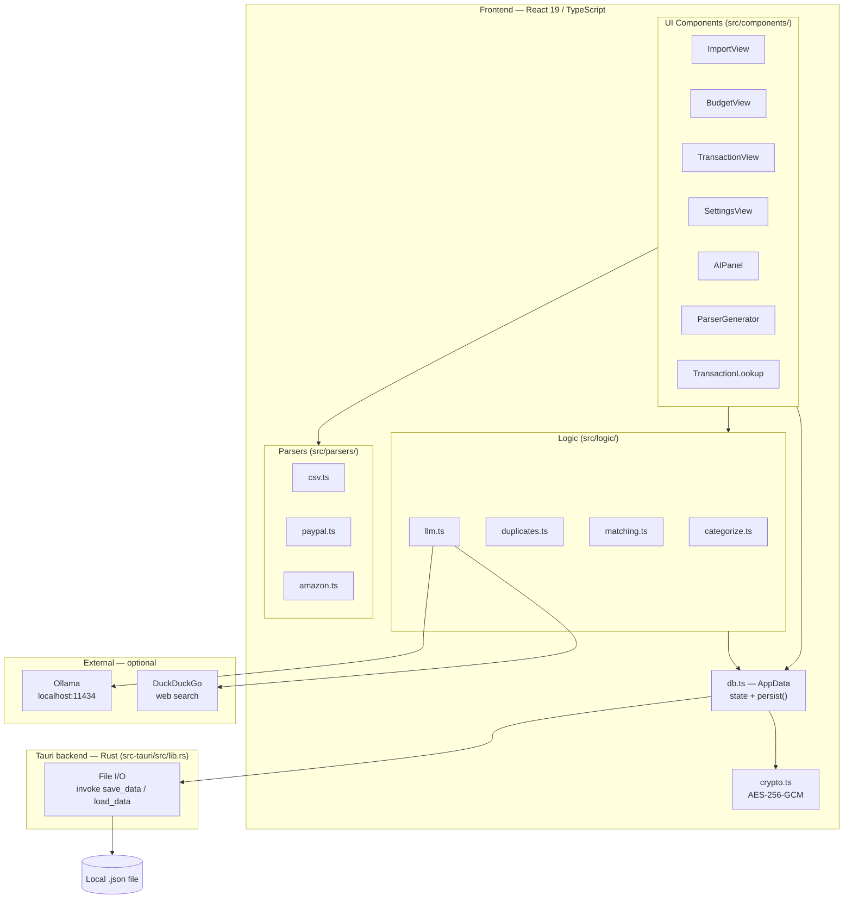

# Architecture

Kestl is a privacy-focused desktop budgeting app built on **Tauri 2** (Rust shell) + **React 19 / TypeScript** (UI). There is no backend server and no cloud sync. All state lives in a single local JSON file the user owns; writes happen synchronously on every mutation via the Rust file I/O layer.

The frontend is split into three layers that sit above a central state module. **`src/db.ts`** is the entire in-memory store and persistence engine — it holds a module-level `AppData` object, exposes typed mutator functions (`addTransaction`, `updateCategory`, …), and calls `persist()` after every change (serialize → optionally encrypt → `invoke('save_data')`). UI components subscribe via React's `useSyncExternalStore`. The **logic layer** (`src/logic/`) contains stateless algorithms — duplicate detection, rule matching, scoring, PayPal linking, refund detection — that read from `db.getData()` but never persist directly. The **parsers layer** (`src/parsers/`) converts raw text from bank exports into `Transaction` arrays that the import pipeline feeds into db.ts.

AI features are optional and fully local. When Ollama is running, `src/logic/llm.ts` makes HTTP calls to `localhost:11434` for parser generation (`generateParser`), single-transaction identification (`lookupTransaction`), and structured budget questions (`answerStructuredQuestion`). All three paths are opt-in; the app is fully usable without Ollama.

## Subsystem diagram

## Flow documentation

| File | What it covers |
|---|---|
| [flows/import.md](flows/import.md) | CSV / PayPal / Amazon import: parse → categorize → dedup → insert → post-processing |
| [flows/categorization.md](flows/categorization.md) | Rule matching at import time and the 4-tier fuzzy scoring for unmatched transactions |
| [flows/save-load.md](flows/save-load.md) | File open/create flow, encryption round-trip, and the persist() write path |
| [flows/state-ownership.md](flows/state-ownership.md) | What lives in AppData, which components read vs. write each slice |
| [flows/ai-features.md](flows/ai-features.md) | All three Ollama integrations: parser generation, transaction lookup, structured questions |
