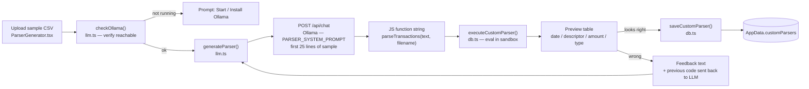
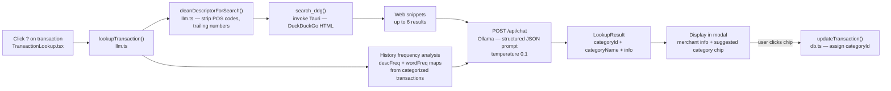
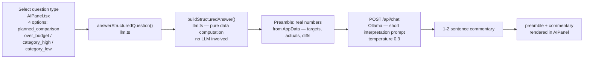

# AI features

All AI features call a local [Ollama](https://ollama.com) instance over HTTP. No data leaves the machine. The default model is `qwen2.5:7b`; this is configurable in Settings → AI.

**Required setup:** Ollama running at `http://localhost:11434` (default) with a model pulled. The app can install and start Ollama on Linux directly from Settings or the parser generator UI.

---

## 1. Custom parser generation

User uploads a sample CSV → LLM writes a `parseTransactions(text, filename)` JavaScript function → the app evals it in-memory → user previews results → save or retry with feedback.

**Key detail:** if the generated parser returns 0 results on the real file but works on the sample, the app auto-detects this and offers "Fix with feedback" rather than silently failing. The retry path sends the original sample, the broken code, and the user's description of the problem to the LLM together.

---

## 2. Transaction deep dive

User clicks `?` on a transaction → `lookupTransaction()` runs a web search and asks the LLM to identify the merchant and pick a category. The user can accept the suggested category with one click.

**Key detail:** the web search is always run before the LLM call (not as a tool call) because small local models like `qwen2.5:7b` reliably call tools when the context is short. The LLM receives both the search results and the history-based suggestion in a single prompt and responds with JSON only.

---

## 3. Structured budget questions (AIPanel)

The AI button opens `AIPanel.tsx`, which presents four pre-defined question types. The app builds the full data answer itself (`buildStructuredAnswer()`) and asks the LLM only for a 1–2 sentence interpretation. This makes answers accurate even with small models.

**Four question types:**
- `planned_comparison` — compares budget targets between two months (requires `monthA`, `monthB`)
- `over_budget` — lists categories that exceeded their target in a given month
- `category_high` — shows all transactions for a category in a month, largest first
- `category_low` — shows a category's transactions vs the prior 3 months; identifies missing descriptors

**Key detail:** `sendChat()` is defined in `llm.ts` (full tool-calling chat loop with all six tools) but is not called by any component in the current codebase. `AIPanel.tsx` uses only `answerStructuredQuestion()`.

---

## Files involved

| File | Role |
|---|---|
| `src/logic/llm.ts` | `generateParser()`, `lookupTransaction()`, `answerStructuredQuestion()`, `buildStructuredAnswer()`, `checkOllama()`, `cleanDescriptorForSearch()`, `sendChat()` (unused) |
| `src/components/ParserGenerator.tsx` | Parser generation UI — 4-step flow: create → preview → confirm → wrong |
| `src/components/TransactionLookup.tsx` | Deep-dive modal — calls `lookupTransaction()`, renders result, applies category |
| `src/components/AIPanel.tsx` | Structured question panel — renders 4 question-type buttons, calls `answerStructuredQuestion()` |
| `src/db.ts` | `executeCustomParser()`, `saveCustomParser()`, `updateTransaction()`, `getAISettings()` |
| `src-tauri/src/lib.rs` | `search_ddg` (DuckDuckGo), `find_ollama`, `install_ollama`, `start_ollama` |
