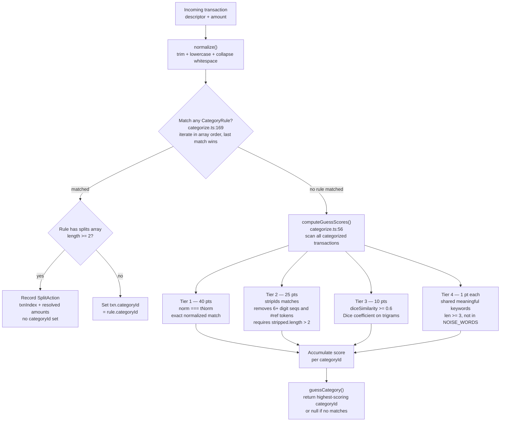

# Categorization flow

There are two distinct categorization mechanisms. **Rule-based assignment** runs at import time inside `categorizeTransactionsInPlace()` and assigns a `categoryId` (or records a split action) before transactions are persisted. **Suggestion scoring** runs on demand via `computeGuessScores()` / `guessCategory()` for transactions that didn't match any rule — it compares against all existing categorized transactions and produces a ranked score map.

## Decision flow

## Rule matching details

Rules are stored in `AppData.categoryRules` and iterated in array order. **Last match wins** — a rule at the end of the list overrides earlier ones. There is no automatic sorting by length or specificity; ordering is fully user-controlled.

`matchType: 'exact'` — `normalize(rule.pattern) === normalize(txn.descriptor)`
`matchType: 'contains'` — `normalize(txn.descriptor).includes(normalize(rule.pattern))`

Optional `amountMatch` — must be within `$0.01` of `txn.amount`.

## Scoring details

**Noise word filtering (Tier 4)** — the `NOISE_WORDS` set (`categorize.ts:25`) excludes common filler: articles, prepositions, payment-type words (`pos`, `purchase`, `debit`, `credit`, `transfer`, `deposit`, `withdrawal`, `payment`), Canadian provincial abbreviations (`bc`, `ab`, `on`, `qc`, …), and corporate suffixes (`inc`, `ltd`, `corp`, `co`, `company`).

**Trigram similarity (Tier 3)** — `diceSimilarity(a, b)` computes `(2 × |intersection|) / (|trigramsA| + |trigramsB|)` where each trigram set is built from all 3-character substrings. Threshold is `0.6`.

**Batch variant** — `batchGetGuessScores()` (`categorize.ts:108`) pre-processes the full transaction corpus once, then scores multiple query descriptors against it. Used when computing suggestions for many transactions simultaneously to avoid redundant `normalize`/`stripIds` work.

## Files involved

| File | Role |
|---|---|
| `src/logic/categorize.ts` | All categorization logic: `categorizeTransactionsInPlace`, `computeGuessScores`, `guessCategory`, `batchGetGuessScores`, `runRuleOnHistory`, `createRuleAndApply` |
| `src/db.ts` | Stores `categoryRules` and `transactions`; `getData()` is called to read both |
| `src/components/ImportView.tsx` | Calls `categorizeTransactionsInPlace()` before inserting transactions |
| `src/components/TransactionView.tsx` | Calls `batchGetGuessScores()` to render suggestion chips on uncategorized rows |
| `src/components/SettingsView.tsx` | Calls `runRuleOnHistory()` when user applies a rule retroactively |
