# Import flow

Triggered by the user dropping a CSV, pasting PayPal activity, or pasting Amazon order history into `ImportView.tsx`. Each source has its own entry-point handler, but all CSV and PayPal paths converge on `insertAndReport()` before persisting.

## Call sequence

```mermaid
flowchart LR
    A["File drop / paste"] --> B{"Import type?"}

    B -->|"Bank CSV"| C["parseBankCsv()\ncsv.ts"]
    B -->|"PayPal paste"| D["parsePaypalPaste()\npaypal.ts"]
    B -->|"Amazon paste"| E["parseAmazonOrders()\namazon.ts"]

    C -->|"0 results"| F["executeCustomParser()\ndb.ts — tries each custom parser in order"]
    C -->|"results"| G["insertAndReport()\nImportView.tsx"]
    F --> G
    D --> G

    E --> EA["categorizeTransactionsInPlace()\ncategorize.ts"]
    EA --> EB["bulkAddTransactions()\ndb.ts"]
    EB --> DONE[("db.transactions")]

    G --> H["categorizeTransactionsInPlace()\ncategorize.ts — rule matching, records SplitActions"]
    H --> I["detectDuplicates()\nduplicates.ts"]

    I -->|"duplicates found"| J["Duplicate review dialog\nuser picks skip / import all / select"]
    I -->|"none"| K["finalizeImportResult()\nImportView.tsx"]
    J --> K

    K --> L["bulkAddTransactions()\ndb.ts — assigns IDs, appends to data.transactions"]
    K --> SA["setSplits()\ndb.ts — for each SplitAction"]

    L --> M{"Source?"}
    M -->|"paypal_paste"| N["matchPaypalTransactions()\nmatching.ts"]
    M -->|"credits present"| O["findRefundCandidates()\nrefunds.ts"]
    M -->|"bank_csv"| P[("db.transactions\npersisted")]
    N --> P
    O --> P
```

## Files involved

| File | Role in this flow |
|---|---|
| `src/components/ImportView.tsx` | Orchestrator — all three handlers, duplicate review UI, refund/PayPal prompts |
| `src/parsers/csv.ts` | `parseBankCsv()` — Scotiabank chequing + credit card CSV → `Transaction[]` |
| `src/parsers/paypal.ts` | `parsePaypalPaste()` — pasted PayPal activity text → `Transaction[]` |
| `src/parsers/amazon.ts` | `parseAmazonOrders()` — pasted Amazon order history → `AmazonParsedOrder[]` |
| `src/logic/categorize.ts` | `categorizeTransactionsInPlace()` — applies rules, returns split actions |
| `src/logic/duplicates.ts` | `detectDuplicates()` — count-based matching against existing transactions |
| `src/logic/matching.ts` | `matchPaypalTransactions()` — links PayPal entries to bank debits |
| `src/logic/refunds.ts` | `findRefundCandidates()` — identifies credits that may be refunds |
| `src/db.ts` | `bulkAddTransactions()`, `setSplits()`, `addAmazonOrders()`, `executeCustomParser()`, `persist()` |

## Edge cases handled

**Deduplication** — `detectDuplicates()` uses count-based matching so that N identical DB entries absorb exactly N incoming duplicates (not more). Four strategies: exact `date|descriptor|amount` key, `date|sourceRef|amount` key (PayPal changes descriptors after linking), pending→captured matching (same instrument + amount within ±5 days, first-6-char prefix match), and prefix match for descriptor drift between statement periods.

**Custom parsers** — if `parseBankCsv()` returns 0 results, each `CustomParser` in `AppData.customParsers` is tried in order via `executeCustomParser()` (evaled JS). First one with results wins.

**Amazon dedup** — Amazon does not go through `detectDuplicates()`; it maintains its own `existingByOrder` map keyed on `orderNum` and updates or skips existing entries rather than checking the general dedup logic.

**Split rules** — if a matched rule carries a `splits` array, `categorizeTransactionsInPlace()` records a `SplitAction` (index + split amounts) instead of setting `categoryId`. After `bulkAddTransactions()` assigns IDs, the split actions are replayed via `setSplits()` using the new IDs.

**Refund prompts** — after any import, newly inserted transactions with `ignoreInBudget = true` (credits) are passed to `findRefundCandidates()`. Matches surface a modal letting the user back-date the refund to the original purchase month.

**PayPal fuzzy matches** — `matchPaypalTransactions()` returns three buckets: `autoMatched` (exact), `fuzzy` (close amount, likely currency conversion), and `unmatched`. Fuzzy matches show a confirmation modal; unmatched show a discard prompt.
