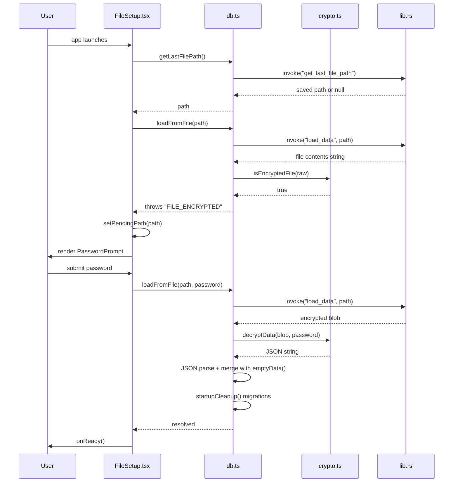
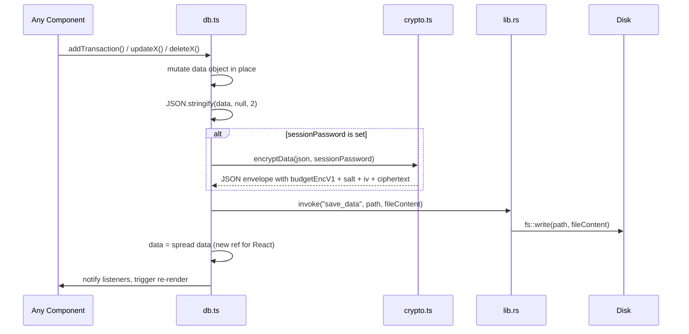

# Save / load flow

The budget is a single `.json` file on disk. When encryption is enabled the file is an AES-256-GCM envelope; otherwise it is plain JSON. The Rust backend handles all filesystem access; the frontend never calls Node or browser file APIs directly.

## Opening an encrypted file



## Saving (every mutation)



## Encrypted file format

Plain JSON files are human-readable. Encrypted files are a JSON object:

```json
{
  "budgetEncV1": 1,
  "salt": "<base64, 16 bytes>",
  "iv": "<base64, 12 bytes>",
  "data": "<base64 AES-GCM ciphertext>"
}
```

`isEncryptedFile()` detects the format by checking for the `"budgetEncV1"` marker string.

## Crypto details

All cryptography is in `src/utils/crypto.ts` using the Web Crypto API (`crypto.subtle`):

- **Cipher:** AES-256-GCM
- **Key derivation:** PBKDF2-SHA256, 100,000 iterations, 16-byte random salt per write
- **IV:** 12-byte random, generated fresh on every `encryptData()` call
- **Wrong password:** AES-GCM authentication fails and `decryptData()` throws `"Wrong password or corrupted file"`

`sessionPassword` is kept in a module-level variable inside `db.ts` and is never written to disk.

## Startup cleanup

After a successful `JSON.parse`, `loadFromFile()` calls `startupCleanup()` (`db.ts:401`). This runs a set of one-time data migrations keyed by string ID in `AppData.completedMigrations` — fixes stale transaction links, normalizes instrument names, backfills category colors, deduplicates bank_csv overlaps, and applies split rules retroactively. Each migration writes its ID to `completedMigrations` so it only runs once.

## Files involved

| File | Role |
|---|---|
| `src/components/FileSetup.tsx` | First-run UI — opens last file automatically, shows open/create/template buttons |
| `src/components/PasswordPrompt.tsx` | Password entry screen rendered when `loadFromFile()` throws `FILE_ENCRYPTED` |
| `src/utils/crypto.ts` | `encryptData()`, `decryptData()`, `isEncryptedFile()` |
| `src/db.ts` | `loadFromFile()`, `persist()`, `createNewFile()`, `createDemoFile()`, `enableEncryption()` |
| `src-tauri/src/lib.rs` | `load_data`, `save_data`, `get_last_file_path`, `set_file_path` Tauri commands |
