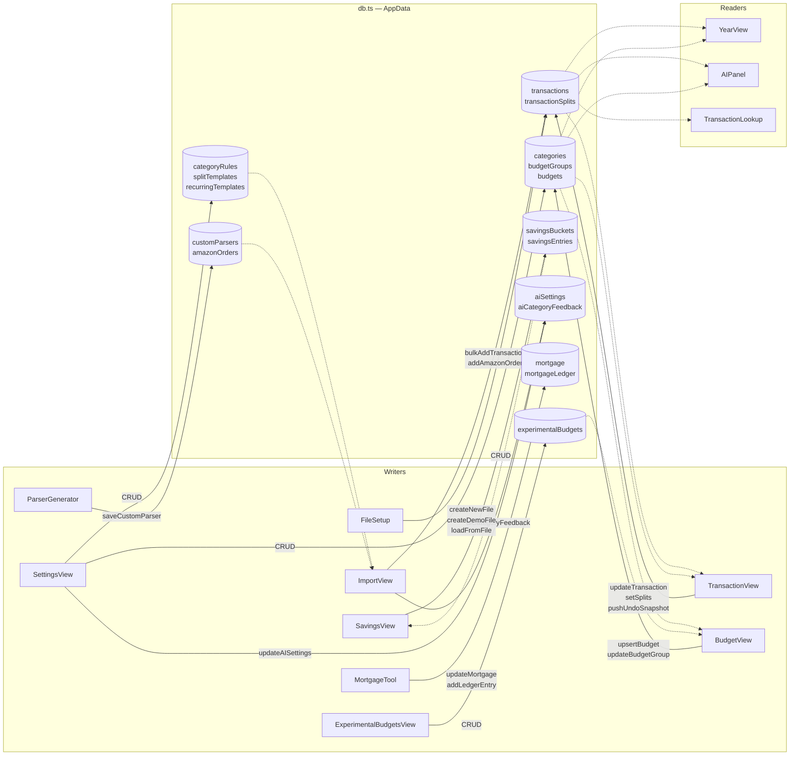

# State ownership

All application state lives in a single `AppData` object inside `src/db.ts`. There is no React context, Zustand, or Redux. Components subscribe via `useSyncExternalStore(subscribe, getData)` and re-render when `persist()` creates a new object reference.

## Ownership map

Solid arrows = write (mutate + persist). Dashed arrows = read only.

## State slices

| Slice | Shape | Primary owner |
|---|---|---|
| `transactions` | `{ id, source, sourceRef, txnDate, amount, instrument, descriptor, categoryId, linkedTransactionId, ignoreInBudget, comment }[]` | ImportView writes; TransactionView edits |
| `transactionSplits` | `{ id, transactionId, categoryId, amount, txnDate? }[]` | TransactionView via SplitEditor |
| `categories` | `{ id, name, isIncome?, color?, note?, savingsBucketId? }[]` | SettingsView |
| `budgetGroups` | `{ id, name, sortOrder, note?, spendFromSavings? }[]` | SettingsView |
| `budgets` | `{ id, month, categoryId, targetAmount, groupId?, sortOrder?, note? }[]` | BudgetView |
| `categoryRules` | `{ id, matchType, pattern, categoryId, amountMatch?, splits? }[]` | SettingsView |
| `splitTemplates` | `{ id, name, items[] }[]` | SettingsView |
| `recurringTemplates` | `{ id, descriptor, amount, instrument, categoryId, dayOfMonth, active }[]` | SettingsView |
| `savingsBuckets` | `{ id, name }[]` | SavingsView |
| `savingsEntries` | `{ id, entryDate, bucketId, amount, notes, source, scheduleId }[]` | SavingsView |
| `customParsers` | `{ id, name, instrument, code, sampleLines, createdAt }[]` | ParserGenerator / SettingsView |
| `amazonOrders` | `{ orderNum, itemName, orderDate, amount, status }[]` | ImportView (Amazon path) |
| `aiSettings` | `{ ollamaUrl, model }` | SettingsView |
| `aiCategoryFeedback` | `{ descriptor, suggestedCategoryId, acceptedCategoryId, outcome }[]` | ImportView (on suggestion accept/reject) |
| `experimentalBudgets` | `{ id, name, createdAt, items[] }[]` | ExperimentalBudgetsView |
| `mortgage` / `mortgageLedger` | config + ledger entries | MortgageTool |
| `nextId` | `number` | Auto-incremented by `nextId()` inside db.ts on every entity creation |
| `completedMigrations` | `string[]` | `startupCleanup()` inside db.ts |
